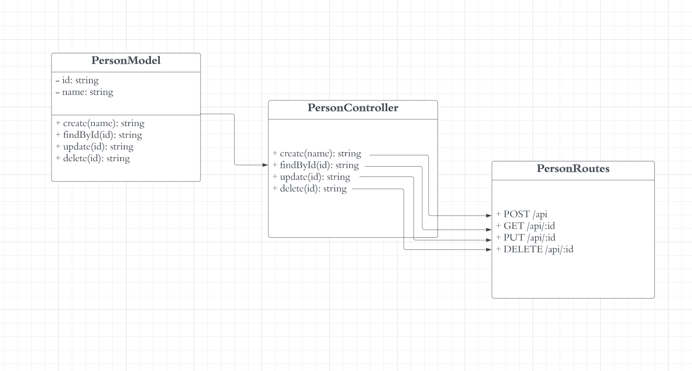
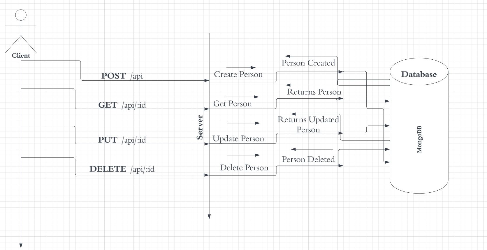

# API Documentation 🚀

This is the official documentation for the **HNGX-Stage-2-Backend-Task**. The API allows client to perform **CRUD** [Create, Read, Update, Delete] operations on a person resouce. Below is the **UML** diagram for the Person Resouce and the API.

## UML Diagrams

### Person Model 🧑‍🦲

The diagram below illustrates the **Person'** Model and Controller Methods mapped to the respective **HTTP Verb**


### API Structure 🚧

The diagram below illustrates the **API** structure, client request made to the server from various route methods and the response passed from the server to the client


## Get Started

To get started, you need to follow the steps below

1. Clone the respository

```bash
    git clone https://github.com/adedoyin-emmanuel/hngx-backend-2.git/
```

2. Cd into clone repository

```bash
    cd hngx-backend-2
```

3. Install project dependencies

```bash
   npm install
```

4. Create .env file

```bash
   mv .env.example .env
```

5. Update .env file with mongodb url

This would start the server and you can now access the **API** from _localhost:2800/api_ ⚠️ you need to have mongoDb compass installed as well as mongodb cluster

## API Endpoints

### 1. Create a new Person

This endpoint expects a `name` key value pair in the request body eg

```json
{
  "name": "Adedoyin Emmanuel"
}
```

**Url** `/api/`

**HTTP Verb** `POST`

**Response**

```json
{
  "code": 201,
  "status": "Created",
  "message": "Person created successfully",
  "data": {
    "name": "Adedoyin Emmanuel",
    "id": "64ff558da892b91a60f4d8e1"
  }
}
```

**Server Error Response**

```json
{
  "code": 500,
  "status": "Internal Server Error",
  "message": "An error occured while creating person",
  "data": {}
}
```

### 2. Get a Person

This endpoint expects an id

**Url** `/api/:id` eg `/api/64ff558da892b91a60f4d8e1`

**HTTP Verb** `GET`

**Response**

```json
{
  "code": 200,
  "status": "OK",
  "message": "Person retrived successfully",
  "data": {
    "name": "Adedoyin Emmanuel",
    "id": "64ff558da892b91a60f4d8e1"
  }
}
```

**Person Not Found Error Response**

```json
{
  "code": 404,
  "status": "Not Found",
  "message": "Person not found",
  "data": {}
}
```

**Server Error Response**

```json
{
  "code": 500,
  "status": "Internal Server Error",
  "message": "An error occured while fetching person",
  "data": {}
}
```

### 3. Update a Person

This endpoint expects an id and a `name` key value pair in the request body eg

```json
{
  "name": "Adedoyin Emmanuel Adeniyi"
}
```

**Url** `/api/:id` eg `/api/64ff558da892b91a60f4d8e1`

**HTTP Verb** `PUT`

**Response**

```json
{
  "code": 200,
  "status": "OK",
  "message": "Person updated successfully",
  "data": {
    "name": "Adedoyin Emmanuel Adeniyi",
    "id": "64ff558da892b91a60f4d8e1"
  }
}
```

**Person Not Found Error Response**

```json
{
  "code": 404,
  "status": "Not Found",
  "message": "Person not found",
  "data": {}
}
```

**Server Error Response**

```json
{
  "code": 500,
  "status": "Internal Server Error",
  "message": "An error occured while updating person",
  "data": {}
}
```

### 4. Delete a Person

This endpoint expects an id

**Url** `/api/:id` eg `/api/64ff558da892b91a60f4d8e1`

**HTTP Verb** `DELETE`

**Response**

```json
{
  "code": 200,
  "status": "OK",
  "message": "Person deleted successfully",
  "data": {}
}
```

**Person Not Found Error Response**

```json
{
  "code": 404,
  "status": "Not Found",
  "message": "Person not found",
  "data": {}
}
```

**Server Error Response**

```json
{
  "code": 500,
  "status": "Internal Server Error",
  "message": "An error occured while deleting person",
  "data": {}
}
```
